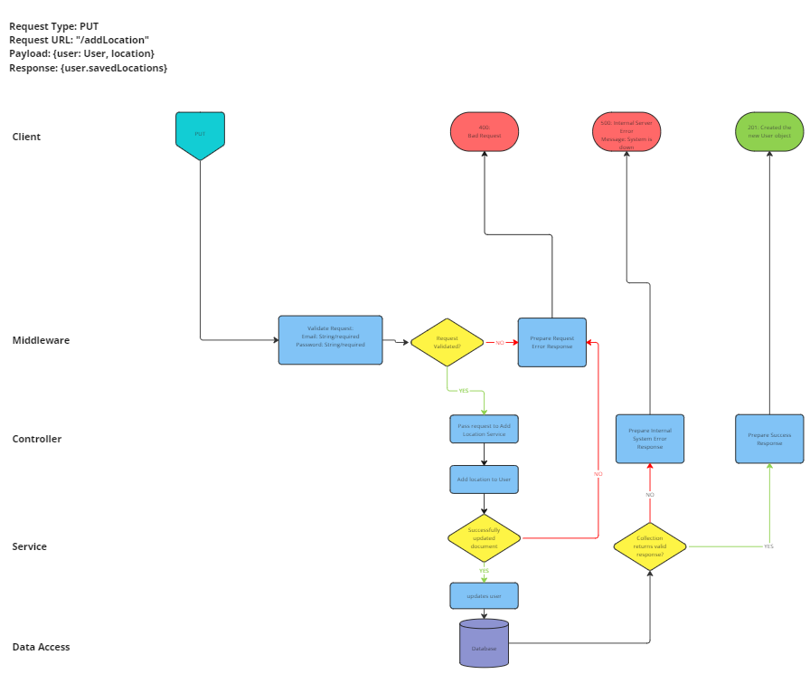

# User Stories

## US-1
- As the frontend
I want to send a users registrations details to the backend,
so that users can create a new account.

## Routing

# US-2
- As the frontend
I want to send the users logins details to the backend
so that users can login

## Routing

# US-3
- As the frontend,
I want to send a request to change a users password,
To allow users to update their password as necessary

## Routing

# US-4
- As the system
I want to check users are logged in or not,
so that I can check if a user has the authorization to use backend

# US-5
- As the frontend,
I want to make a request to the backend to add a new location,
so that users have can store their favourite locations.

## Routing

# US-6
- As the frontend,
I want to make a request to get all the saved locations of a user,
so that users can see their saved locations

## Routing

# US-7
- As the front end,
I want to make a request to remove a saved location from a user,
so that users can update their saved locations.

## Routing

# Domain Model

